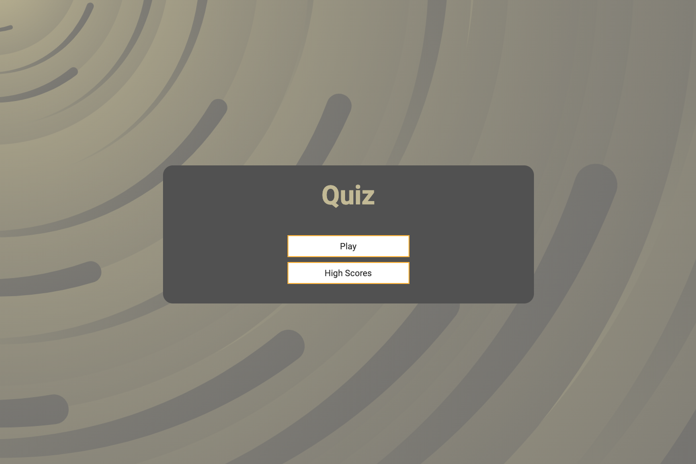
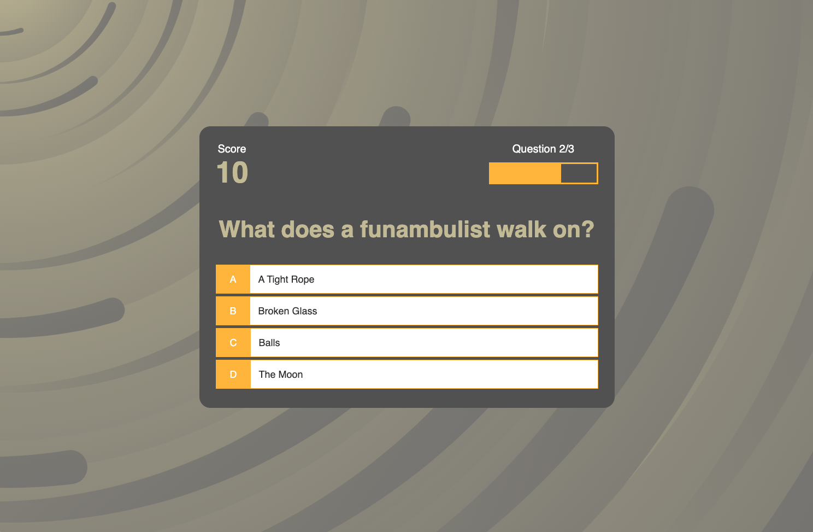

# Vanilla JavaScript Quiz App

This multi-page vanilla JS Quiz app uses the Fetch API to retrieve general knowledge questions to ask the user. High scores are saved to local storage so that users are able to return to the app and try to beat their previous attempts.

## Tech Stack

**Client:** HTML5, CSS3, ES6+

## Demo

App can be found at the following [link](https://js-quiz-app-mo.netlify.app/).

## Screenshots

